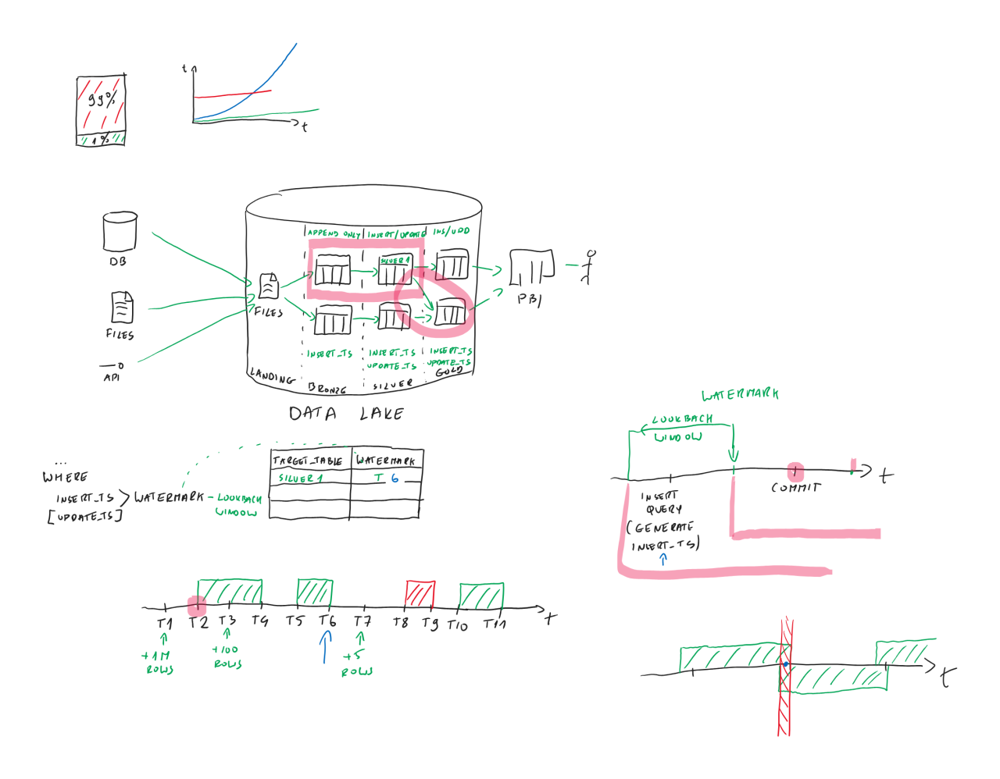

# Wprowadzenie

Wprowadzenie i sprawy organizacyjne.

**Materiały:**  
[Wprowadzenie](https://github.com/DataCommunityTrojmiasto/Meetups/blob/main/2026/33_202606.24/Wprowadzenie%2033%20spotkanie.pdf)

# Prezentacje

## 1) Hubert Jegierski – Prompt to za mało: jak projektować kontekst dla LLM-ów i automatyzować jego poprawianie

Sesja poświęcona wyzwaniom związanym z utrzymywaniem efektywnych promptów. Prelegent wyjaśni, dlaczego samo napisanie lepszej instrukcji nie wystarczy i gdzie zaczyna się context engineering. Omówi zagadnienia związane z promptowym długiem technicznym, wpływem kontekstu na jakość odpowiedzi oraz problemy ze skalowaniem ręcznych popraw. Na zakończenie zaprezentuje narzędzie DSPy, wspierające automatyczne wyszukiwanie lepszych promptów.

**Materiały z prezentacji:**  
[Prezentacja](https://github.com/DataCommunityTrojmiasto/Meetups/blob/main/2026/33_202606.24/Context%20Engineering%20-%20Data%20Community.pdf)  
[Repozytorium z kodem](https://github.com/HJegierski/prompt-optimization/)

## 2) Piotr Tybulewicz – Jak przetwarzać tylko to, co się zmieniło - wzorzec niezależny od technologii

Przedstawienie uniwersalnego wzorca wykrywania zmian działającego niezależnie od platformy (Azure, Fabric, Databricks, dbt, Snowflake, on-prem). Podejście umożliwia pominięcie już przetworzonych danych i skupienie się wyłącznie na rzeczywistych zmianach.

**Materiały z prezentacji:**  
[Prezentacja](https://github.com/DataCommunityTrojmiasto/Meetups/blob/main/2026/33_202606.24/Jak%20przetwarza_%20tylko%20to%20co%20si_%20zmieni_o.pptx)  
[Demo 1 - Bronze to Silver](https://github.com/DataCommunityTrojmiasto/Meetups/blob/main/2026/33_202606.24/Demo%201%20-%20Bronze%20to%20Silver.ipynb)

# Nasi prelegenci

## Hubert Jegierski

Machine Learning Engineer z ponad 8-letnim doświadczeniem. Rozwija i wdraża rozwiązania AI/ML łączące perspektywę akademicką i przemysłową, ze specjalizacją w NLP, predictive maintenance, detekcji anomalii i analizie danych biomedycznych. Aktualnie skupia się na zastosowaniach modeli LLM w zarządzaniu wiedzą.

## Piotr Tybulewicz

Doświadczony specjalista od danych i data engineeringu, zwłaszcza w środowisku Azure.
